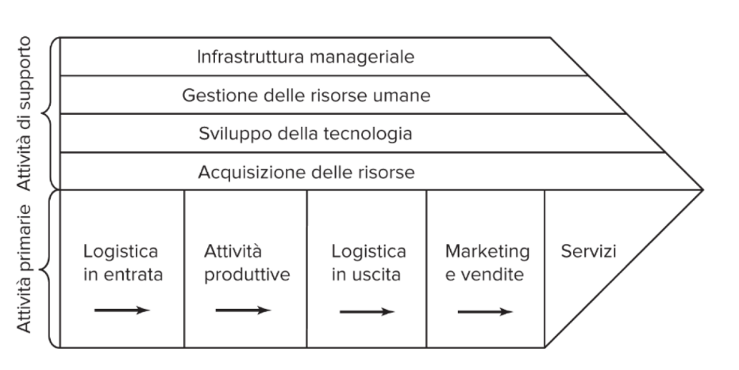

## CAP 6 - La definizione dell'orientamento strategico

### Analisi dell'ambiente esterno
Per l'analisi dell'ambiente esterno si utilizzano principalmente due strumenti: (1) le 5 forze di Porter, l'analisi degli **stakeholder**

#### Il modello delle 5 ==> (6) forze di porter

Serve per misurare il grado di attività di un settore. Le 5 forze di porter sono le seguenti:

- **Il grado di rivalità competitiva**: in linea di massima, maggiore è il numero di concorrenti, maggiore sarà la competitività. Fanno eccezione i **mercati oligopolistici**, infatti in essi le poche aziende leader possono iniziare una guerra dei prezzi (distruttiva). Un altro fattore che influenza la competitività è il grado di differenziazione dei concorrenti. Anche la domanda influenza la rivalità, un alta domanda attenua le pressioni, mentre una domanda scarsa porta ad un inasprimento dei rapporti in quanto le aziende del settore devono acapparrarsi ogni spazio possibile.
- **La minaccia di entranti potenziali**: il potenziale insertimento di nuovi entranti è influenzata sia dal grado di attrazione esercitato dal settore, sia dall'altezza delle **barriere all'entrata** (costi start-up, brand loyalty, difficoltà d'accesso ai canali di distribuzione).
- **Potere contrattuale dei fornitori**: se ci sono pochi fornitori e sono differenziati, allora l'azienda non avrà ampio margine di scelta, se invece i fornitori fossero molti e poco differenziati, l'azienda potrebbe fare leva su questo fatto per farli concorrere. Il potere contrattuale del fornitore cala drasticamente nel momento in cui l'azienda compie o minaccia di compiere un **integrazione verticale a monte**, cioè produce o minaccia di produrre essa stessa ciò che il fornitore sta fornendo.
- **Potere contrattuale degli acquirenti**: se un'impresa dipende da un numero ridotto di clienti, il loro potere contrattuale sarà elevato. Se il passaggio al nuovo prodotto comporta degli switching cost, il potere contrattuale degli acquirenti diminuisce, mentre se è l'azienda a dover sostenere gli switching costs per interecettare una categoria di utenti, sarà essa ad avere il proprio potere contrattuale abbassato.
- **La minaccia dei prodotti sostitutivi**: sebbene di regola non siano da considerare come concorrenti diretti, hanno un ruolo equivalenti dal punto di vista del cliente. Esempio, treni ed arei non sono concorrenti diretti, tuttavia il sistema ferroviario rappresenta una minaccia per le imprese del mondo aereo, allo stesso modo i voli low-cost sulle medio-lunghe tratte rappresentano una minaccia per trenitalia. La differenza tra concorrente e prodotto sostitutivo dipende in realtà dal settore di analisi. Se si parla del settore trasporto, allora treni ed aerei sono effettivamente concorrenti.
- **Prodotti complementari**: sono i beni, servizi e risosre che potenziano l'utilità/attrattività di un bene. La loro diffusione/disponibilità rappresentano chiaramente un fattore critico per le imprese che lavorano nel settore.

#### Analisi degli stakeholders
- Analisi strategica: pone l'accento su queli aspetti della gestione degli stakeholders che potrebbero influenzare l'andamento economico/finanziario dell'azienda
- Analisi normativa: si focalizza sull'analisi della gestione degli stakeholder in ragione delle implicazioni etico/morali che rivestono.

La *stakeholder analysis* prevede in generale l'analisi degli interessi, delle attese e delle possibili rivendicazioni di ogni stakeholder. Gli stakeholder possono essere clienti, azionisti, creditori, amministrazioni locali, la comunità locale, etc..

### Analisi dell'ambiente interno
L'analisi dell'ambiente interno si apre con l'analisi dei punti di forza e debolezza dell'impresa. A volte si sceglie di analizzare una ad una quelle che sono le attività della catena del valore dell'impresa, che però può essere diversa a seconda dell'azienda in questione. In aziende Biotech ad esempion R&D sarà fra le attività primarie. Ogni attività può essere quindi valutata in base a quanto contribuisce al valore complessivo dell'impresa.

Una volta valutati punti di debolezza e forza, i manager dovranno valutare quali fattori offrano fonte di vantaggio competitivo. Questa valutazionei inciderà sulla la scelta delle attività, delle risorse e delle competenze su cui basare l'elaborazione dell'intento strategico per il futuro.

Caratteristiche delle **risorse**: per rappresentare una fonte di vantaggio competitivo sostenibile, le risorse devono essere **rare, di valore, durevoli e difficili da imitare**. Se le risorse sono facili da imitare c'è il rischio che i competitor risalgano, attraverso il reverse engineering, al meccanismo base. Se invece le risorse di valore:

- sono **tacite** (cioè se non sono codificabili)
- presentano una **path dependency** (cioè sono esito di una particolare e lunga successione di eventi)
- sono **socialmente complesse** (cioè prodotte dall'interazione di più individui)
- sono caratterizzate da **ambiguità causale** (cioè non è identificabile chiaramente il processo per cui essa crei valore)

Dopo aver effettuate un analisi di base dell'ambiente interno, il management può procedere all'individuazione delle core competency dell'impresa e alla definizione dell'intento strategico.

### Core competency
Per core competency si intendono quelle **competenze distintive che differenziano un'azienda sotto il profilo strategico**. Una core competency nasce dalla capacità dell'impresa di **combinare e integrare una molteplicità di capacità primare**, in cui eccelle, allo scopo di fondare le piattaforme su cui costruire competenze specialistiche. Una o più core competency possono portare allo sviluppo dei **core product**, che a loro volta possono dare vita a unità di business che producono poi i beni da introdurre nel mercato.

Una **core comptency** generalmente ha le seguenti **caratteristiche**:

- fonte di differenziazione signficativa dai competitor, **conferisce unicità**
- possono essere **sfruttate in più buisness** (Honda produce motori non solo per auto)
- sono d**ifficili da imitare**

A volte proprio queste aree di eccellenza di un'impresa rappresentano una fonte di rischio. Infatti un'azienda troppo legata alla proprie core competency potrebbe non essere più in grado di svilupparne nuove, proprio perchè rimane attaccata al modello passato sui cui è già esperta e ha perso man mano la flessibilità necessaria. Tale fenomeno è denominato **core rigidity**.

#### Capacità dinamiche dell'impresa
Sebbene molte core competency siano associate ad un set di tecnologie/prodotti, ce ne sono alcune associate ad una serie di **capacità che predispongono** l'impresa ad una r**apida riconfigurazione della propria struttura**/routine/.. in risposta alle nuove opportunità di mercato. Tali competenze sono definite **capacità dinamiche** e consentono all'impresa di adattarsi anche alle discontinuità tecnologiche.